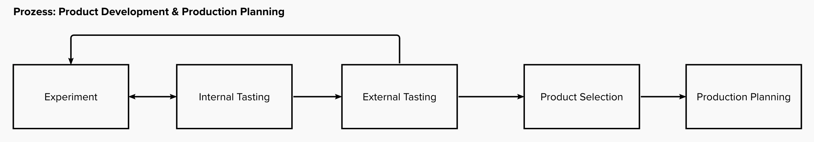
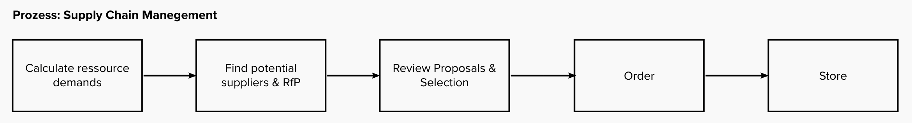
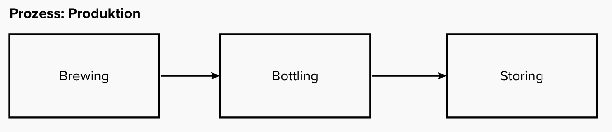
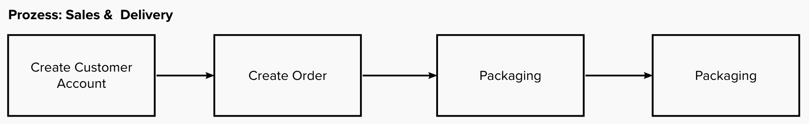

# Sepplpeter's MicroBrewery Processes

This document describes the processes of the MicroBrewery Sepplpeter's. The brewery is owned and run by three friends who manage the whole small company. The friends are Bert, Eddi and Johnny.

## Assumptions

* We assume that our MicroBrewery already successfully produces and sells two types of Beer: Sepplpeter's Weiss and Sepplpeter's Original.
* The brewery wants to produce one additional seasonal beer in summer and in winter.

## Product Development and Production Planning

**Experiment**. In the first phase all three guy's experiment at home on their selves with their own small-scale brewery equipment. We do not consider costs and purchasing of raw-materials, ingredients and stuff required for the experiments. The only thing all three openly share are the experiment logs, including the ingredients and the brewing journal they recorded during experimentation. 

At the end of each experiment, each one rates his own beers with a simple rating between 1 and 10. On a regular basis good tasting beers are marked to be tested during the bi-monthly internal tasting session.

**Internal Tasting**. During a bi-monthly internal tasting session all beers are drunk and tasted by each of the owners. Each owner rates the beer proposed by their colleagues with a rating between 1 and 10.

**External Beer Tasting**. Every half year an external tasting session should be conducted. The goal of the tasing session is to select the next seasonal beer. In advance of the session, they select the top 5 beers based on their own ratings. If more beers can be selected, becuase they are equally rated, the candidates are selected randomly.

The beer tasting is done by organizing a party in Johnny's Haevy Metal Festival garden. A band is invited, a quite well tasting barbecue is arranged and a bar is offering the selected 5 beers for free. For each beer type 200 litres are available.

**Product Selection**. The best beer will be selected based on the highest consumption during the party. If more than one beer is completely drunk, the beer which was drunk earlier will be selected.

**Production Planning**. Based on historic sales data and experience from the past, the brewers decide together how much beer should be produced in the following six months. The plans are made for all three types.

## Supply Chain Management

The supply chain process takes care of ordering and buying all required materials and ingredients to brew, bottle and sell the beer.

**Calculate Demand**. The demand is calculated on basis of the production planning and on basis of the current raw material existing in the store.

**Find potential suppliers**. Potential suppliers are contacted and asked for a bid to provide the different raw materials. In our scenario we know 12 different suppliers, who offer parts of the material and who are asked for the thw bid.

**Review Proposals & Selection**. The received bids are reviewed, based on price and experience with the supplier, the suppliers are selected. In our scenario we make delivery contracts for 6 months. The agreements/ contracts confirm that a planned amount (or range) will be ordered within these six months. The actual order are placed on demand.

**Order**. When materials are needed, they are ordered with an expected delivery date.

**Receive & Store**. The materials are received, sometimes in multiple shipments, and stored in the warehouse.

## Production Process

Woooo! Actually the beer gets brewed and bottled in production. At the end of the production process the ready to sell bottles are stored in the warehouse.

## Sales and Delivery Process

Finally the brewery needs to earn money. This is done via two channels: An internet shop and a phone hotline. In both cases the high-level process is quite similar:

**Create Account**. Every (new) customer needs to create a customer account.

**Create Order**. A customer creates a new order including the items (beers) and the oredered amount. An order reserves the ordered beer in the warehouse, so that the beer cannot be bought by another customer.

**Packaging**. When the order is completed. The packaging is done during the next following days (the space is freed in warehouse). The package is given to the Postman to deliver it to the clients.

**Delivered**. The post services confirms that the package has been delivered and we can assume that the client is happy.